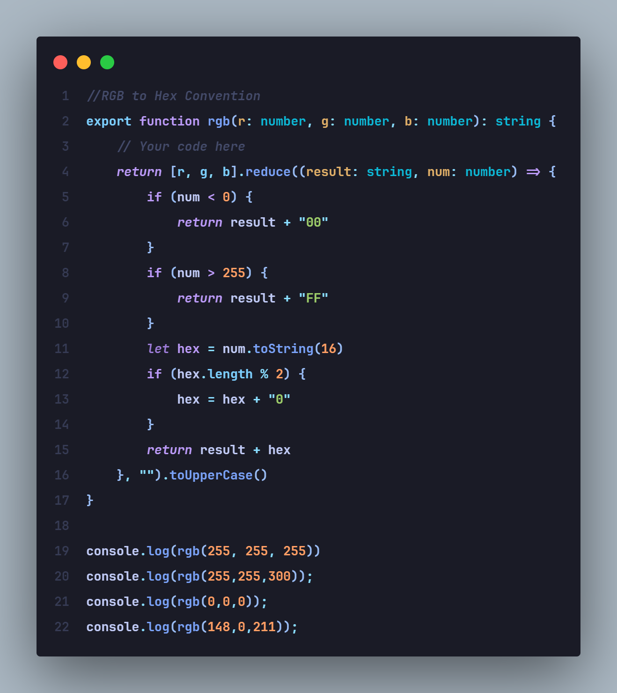
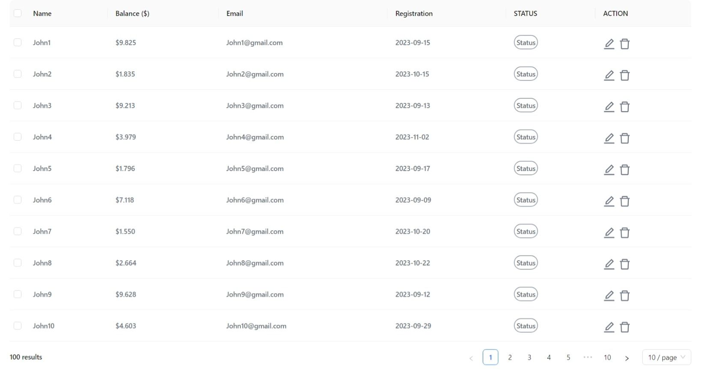

# Frontend Developer Hiring Test

This test is designed to evaluate my skills and knowledge as a frontend developer. The purpose of this test is to assess my ability to implement a frontend project according to the given requirements.


## Run Locally

Clone the project

```bash
  git clone https://github.com/phuphung330/Frontend-Test.git
```

Go to the project directory

```bash
  cd App_Development_Test
```

Install dependencies

```bash
  yarn
```

Start the server

```bash
  yarn run dev
```


## Screenshots
 1.Logic Test
 
  
 2.App Development Test.
 

 
## Tech Stack

**Client:** React, Ant Design, TailwindCSS,Moment.


